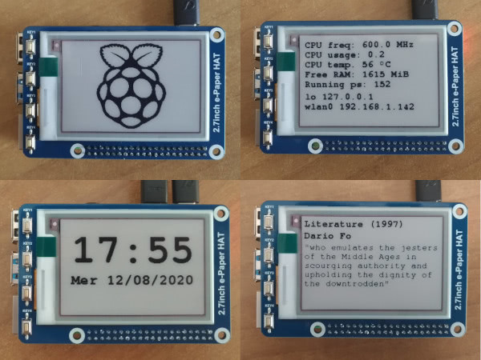

# Raspberry Pi eInk Smart Screen

_Smart Clock / Sysmon / Nobel-card for Raspbery Pi 3 using the e-Paper 2.7 inch display from Waveshare._

Originally inspired by the [vekkari](https://github.com/jaittola/vekkari) project by [Jukka Aittola](https://github.com/jaittola), this project has quickly evolved into a new project: a fully-featured smart clock. All you need is a Raspberry-Pi 3/4 and the e-Paper 2.7 inch display from Waveshare.

The eInk Smart Clock has multiple display modes, selectable using the four push-buttons soldered on the HAT:
- Raspberry Pi Logo (sort of standby mode)
- Clock (hours and minutes, day of the week, date) with 1 minute refresh interval
- System statics  (CPU, RAM, Processes, IP addresses)
- Nobel Prize information (year, category, winner and motivation - offline dump of the official data obtained from http://api.nobelprize.org/v1/prize.json)

Data are refreshed every minute.

## Buttons

- Button 1: Show Raspberry Logo
- Button 2: Show System Statics
- Button 3: Show Clock (time & date)
- Button 4: Show random Nobel info

### Photos



## Hardware Requirements

- Raspberry Pi 3
- [2.7inch E-Ink display HAT for Raspberry Pi](https://www.waveshare.com/product/raspberry-pi/displays/e-paper/2.7inch-e-paper-hat.htm)
- 8+ GB SD card

## Installation

- Install [Raspberry Pi OS](https://www.raspberrypi.org/downloads/) on SD card and boot the system
- Open a terminal
- ```python3``` should be already present on Raspberry Pi OS - you may want to verify this by running: ```python3 --version```
- Enable SPI:
  - Run the configuration tool: ```sudo raspi-config```
  - Choose: ```Interfacing Options -> SPI -> Yes```  to enable SPI interface
  - Reboot: ```sudo reboot```
- Reopen a terminal
- Update package list: ```sudo apt-get update```
- Install required libraries and python modules
  - Install wiringPI: ```sudo apt-get install wiringpi```
  - Install required Python3 libraries
    - ```sudo apt-get install python3-pil python3-numpy python3-psutil python3-spidev python3-spidev python3-rpi.gpio```
  - Install BCM2835 libraries
    - ```wget http://www.airspayce.com/mikem/bcm2835/bcm2835-1.68.tar.gz```
    - ```tar zxvf bcm2835-1.68.tar.gz```
    - ```cd bcm2835-1.68/```
    - ```./configure```
    - ```make```
    - ```sudo make install```
- Go back to home ```cd```
- Install git: ```sudo apt install git```
- Fetch this project: ```git clone https://github.com/emanueleg/rpi-eink-clock.git```
- Enter the project directory: ```cd rpi-eink-clock``` and install required libraries and python modules
- Run the script: ```./epaper-clock.py``` and verify if it works as expected (hit Ctrl-C to exit)
- If you want the script run at every boot, install this project as service so it could automatically run when Raspberry boots up [TODO]

## License

* Official Waveshare Electronic paper driver/libraries (```epdconfig.py``` and ```epdconfig.py```) are available under the MIT License.
* The official Raspberry Pi Logo used in ```raspberry.bmp``` is a (TM) of Raspberry Pi Foundation (https://www.raspberrypi.org/) and available under the [Raspberry Pi Trademark rules and brand guidelines](https://www.raspberrypi.org/trademark-rules/)
* Nobel data are provided by Nobel Media AB and are available under the Creative Commons Zero (CC0) license - see the [Terms of Use for api.nobelprize.org and data.nobelprize.org ](https://www.nobelprize.org/about/terms-of-use-for-api-nobelprize-org-and-data-nobelprize-org/)
* This project is a fork, hence the original license still apply to the initial edits. Since commit [02cc076](https://github.com/emanueleg/rpi-eink-clock/commit/02cc0761417e3218ac8d37ea247866298c6cf17e) quite all the code is brand new: the license for the project is now the Apache License 2.0
